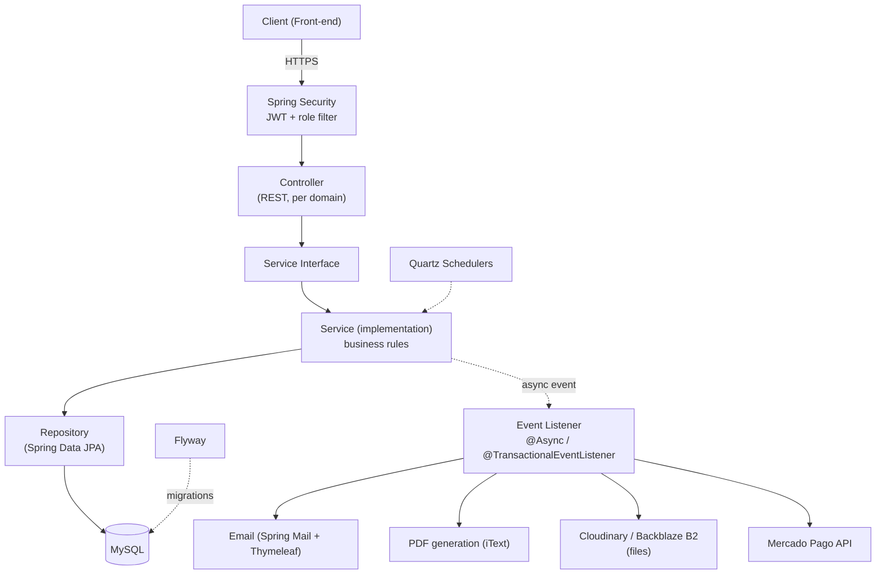
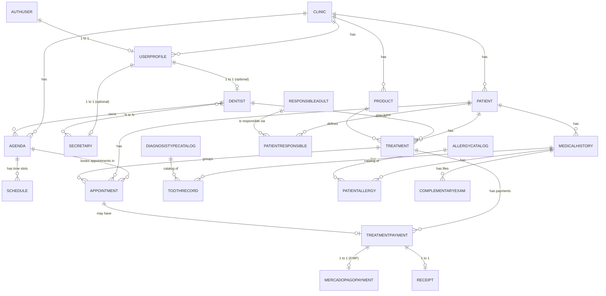

# 🦷 Dentify Backend — Onboarding Guide (v2)

> Living document. Last updated: August 2026. If something changed in the code and not here, the code wins.


---

## 1. Executive summary

**Dentify** is the backend for a SaaS platform for dental clinics. It lets a dentist (and, eventually, a secretary with reduced permissions) fully manage a clinic: patients and medical histories, appointments, schedules, products/services, payments and finances.

*What does this mean?* — "SaaS" (Software as a Service) means a single backend instance serves **many different clinics** at the same time, each with its own isolated data. This is called **multi-tenancy**, and it's a central concept of the project (see section 8).

**For whom:** dentists who manage their own clinic (or are part of one), and eventually secretaries operating with reduced permissions.

**Current status:** ~90% functional from the dentist's point of view. It can: register patients with a complete medical history (including file uploads), create products/services, manage appointments and schedules, and process payments (cash and Mercado Pago). The secretary view isn't implemented yet — it's expected to reuse most of the dentist's logic with reduced permissions, but the fine-grained details of "what exactly they can access" aren't formally defined yet.

**Repository:** [dentify-backend](https://github.com/matias-devv/dentify-backend) — single `master` branch (no separate `dev`; everything lives there).

---

## 2. General architecture

### 2.1 Component view



*What does this mean?* — Every "domain" (appointment, patient, payment, etc.) always follows the same path: **Controller → Service (interface + implementation) → Repository → Database**. This is the classic MVC pattern, but "merged" with **DDD** (Domain-Driven Design) ideas: instead of having one `controllers/` folder with every controller together, each business entity (`patient`, `appointment`, `payment`...) has its own folder containing its controller, service, repository, model and DTOs. See section 5.

### 2.2 Multi-tenancy

The system is multi-tenant: every `Clinic` has a `tenantId` (UUID). Almost all relevant entities extend `TenantEntity`, and Hibernate automatically applies a filter by `tenant_id` on every query. A dentist or secretary never sees another clinic's data — if they try to access a resource that isn't theirs, the API responds with `404` (not `403`), so as to not even leak the resource's existence.

Within the same clinic there's also an additional privacy layer: some data belongs specifically to the **dentist who owns the clinic** (for example, their finances) and a secretary, even within the same clinic, shouldn't be able to see it. This distinction is planned but not yet fully formalized in the permissions code.

### 2.3 Asynchronous processing

For heavy operations (sending emails, generating PDFs, uploading files, calling Mercado Pago), the synchronous request flow only does the strictly necessary work (validate, persist) and fires a **domain event** that a listener processes in the background using `@Async` + `@TransactionalEventListener(phase = AFTER_COMMIT)`. This means the endpoint responds quickly and everything else happens afterward, without blocking the user. The best-documented example of this pattern is `saveAppointmentWithPay` (section 6).

---

## 3. Tech stack

| Tool | Version | Why it's used |
| --- | --- | --- |
| Java | 17 | LTS, strongly typed, mature ecosystem for enterprise backends. |
| Spring Boot | 4.0.x | Base framework: dependency injection, configuration, fast bootstrap. |
| Spring Data JPA / Hibernate | (via Boot) | Object-relational mapping; avoids hand-writing SQL for standard CRUD. |
| MySQL | 8.0 | Relational database, well suited for a domain with many relationships (patient-appointment-payment-treatment). |
| H2 | runtime/test | In-memory database for tests, avoids depending on a real MySQL instance in CI. |
| Spring Security + JWT | (via Boot) | Stateless authentication/authorization, with roles and granular permissions. |
| Flyway | (via Boot) | Database schema versioning — every change is left as an auditable migration. |
| Lombok | — | Reduces boilerplate (getters/setters/constructors). |
| SpringDoc OpenAPI / Swagger UI | 2.5.0 | Automatic API documentation generated from code annotations. |
| Quartz | (via Boot) | Scheduled tasks (appointment reminders, notification retries, etc.). |
| iText (kernel + layout) | 7.2.5 | PDF generation for payment receipts. |
| Cloudinary | 2.3.2 | Image/file storage with public URLs (used in the medical history flow). |
| AWS SDK S3 | 2.47.6 | S3 client, used to integrate with Backblaze B2 (S3-compatible storage) for supplementary exams. |
| Backblaze B2 | — | Low-cost file storage, S3-API compatible. |
| Twilio | 11.3.3 | WhatsApp SDK — dependency included, but actual sending is disabled (see roadmap). |
| Spring Mail + Thymeleaf | (via Boot) | Transactional email sending with HTML templates. |
| Mercado Pago SDK | 2.8.0 | Online payment processing (payment preferences, webhooks). |
| Guava | 33.0.0 | Assorted utilities (collections, etc.). |
| Docker / Docker Compose | — | Spin up the app + MySQL without installing anything else. Specifically meant so someone new to the project can get started without configuring IntelliJ or 20 settings by hand. |

---

## 4. Setup and installation

### 4.1 Requirements

- Docker and Docker Compose (recommended — the main path designed for onboarding).
- Alternatively: Java 17 + Maven, if you prefer running without Docker.

### 4.2 Clone the repo

```bash
git clone https://github.com/matias-devv/dentify-backend.git
cd dentify-backend
```

### 4.3 Environment variables

The project uses an `env.example` file as a template. Copy it to `.env` and fill in the values:

```bash
cp env.example .env
```

Groups of variables you'll need to fill in (the actual values — passwords, tokens, keys — ask Matías for them, they're not shared in this document):

| Group | Variables |
| --- | --- |
| General | `BASE_URL` |
| Demo dentist (seed data in `dev`) | `DENTIST_DEMO_EMAIL`, `DENTIST_DEMO_PASSWORD` |
| Database | `DB_USERNAME`, `DB_PASSWORD` (the `DB_URL` is already fixed in `docker-compose.yml`, pointing to the `dentify-db` container) |
| Platform admin | `ADMIN_EMAIL`, `ADMIN_PASSWORD` (auto-created by `AdminSeeder` on first boot) |
| Spring Security (basic auth) | `SS_USERNAME`, `SS_PASSWORD`, `SS_ROLE` |
| JWT | `PRIVATE_KEY`, `USER_GENERATOR` |
| Mercado Pago | `MP_TOKEN`, `MP_KEY`, `MP_URL`, `MP_SECRET` |
| Email | `EMAIL_USERNAME`, `EMAIL_PASSWORD` |
| Twilio (WhatsApp, disabled) | `TWILIO_ACCOUNT_SID`, `TWILIO_AUTH_TOKEN`, `TWILIO_WHATSAPP_FROM` |
| Cloudinary | `CLOUDINARY_NAME`, `CLOUDINARY_API_KEY`, `CLOUDINARY_API_SECRET` |
| Backblaze B2 | `B2_APPLICATION_KEY_ID`, `B2_APPLICATION_KEY`, `B2_BUCKET_NAME`, `B2_ENDPOINT`, `B2_REGION`, `B2_PRESIGNED_URL_EXPIRATION_MINUTES`, `B2_MAX_FILE_SIZE_MB` |

*What does this mean?* — None of these credentials are hardcoded in the code or pushed to the repo (`.env` is in `.gitignore`). They're injected into the container as environment variables.

### 4.4 Run with Docker Compose

```bash
docker compose up --build
```

This spins up two containers:

- `dentify-app`: the API, at `http://localhost:8008`.
- `dentify-db`: MySQL 8.0.33, exposed on host port `3307` (so you can connect with a local DB client without clashing with a local MySQL on 3306).

The active profile is `dev` (`SPRING_PROFILES_ACTIVE=dev`), which enables `DemoDataSeeder` — preloaded sample data so you don't start with an empty database.

### 4.5 Alternative without Docker

```bash
mvn spring-boot:run
```

Requires a MySQL instance running locally and configuring the equivalent environment variables by hand (or in `application.properties`).

### 4.6 Interactive API documentation

Once the app is up:

```
http://localhost:8008/swagger-ui/index.html
```

---

## 5. Project structure

*What does this mean?* — Instead of grouping code by "technical type" (all controllers together, all services together), Dentify groups by **business domain**. Each folder under `domain/` is a central entity (patient, appointment, payment...) and contains its own complete mini-MVC inside.

```
src/main/java/com/dentify/
├── domain/                      # the heart of the business — one package per entity
│   ├── appointment/              # appointments
│   │   ├── controller/
│   │   ├── dto/{request,response}/
│   │   ├── enums/
│   │   ├── event/                # domain events + listener + publisher
│   │   ├── model/
│   │   ├── repository/
│   │   └── service/
│   ├── patient/                  # patients
│   ├── medicalhistory/           # medical histories
│   ├── toothrecord/               # tooth records (odontogram)
│   ├── payment/                  # payments (TreatmentPayment)
│   ├── mercadopagopayment/        # Mercado Pago–specific data
│   ├── treatment/                # treatments (group appointments + debt for a product)
│   ├── agenda/ , schedule/        # schedules and time slots
│   ├── product/                  # products/services
│   ├── dentist/ , secretary/      # professional profiles
│   ├── clinic/                   # the clinic (tenant)
│   ├── invitation/                # dentist/secretary invitations
│   ├── notification/              # log of sent notifications
│   ├── receipt/                  # PDF receipts
│   ├── complementaryexam/         # files attached to a medical history (x-rays, studies)
│   ├── allergycatalog/ , diagnosistypecatalog/  # global/per-clinic catalogs
│   ├── responsibleadult/          # responsible adults (minor patients)
│   ├── speciality/                # dental specialities
│   └── userProfile/                # profile data shared by dentist/secretary
├── calendar/                     # availability logic (month/week/day) — not a persisted "entity", it's a query service
├── dashboard/                    # metrics and summary for the main screen
├── security/                     # everything auth-related: JWT, roles, permissions, multitenancy
│   ├── multitenancy/               # TenantContext, TenantEntity, resolver
│   ├── filter/                    # JwtTokenValidator
│   └── seeder/                    # AdminSeeder, DemoDataSeeder, RolesPermissionsSeeder
├── integration/                  # external service clients
│   ├── cloudinary/ , filestorage/ (B2/S3)
│   ├── email/
│   ├── mercadopago/
│   └── whatsapp/                  # WhatsAppService — present but not active in production
├── exception/                     # business exceptions + GlobalExceptionHandler
├── mapper/                       # entity ↔ DTO conversion (one per domain)
├── scheduler/                     # Quartz jobs (appointments, receipts)
├── config/                        # bean configuration (CORS, Mercado Pago, Cloudinary, async, OpenAPI)
└── OdontologiaApplication.java    # main
```

Inside each domain, the convention is:

- `model/` → the JPA entity.
- `dto/request/` and `dto/response/` → what goes in and out over HTTP (the entity is never exposed directly).
- `repository/` → interface `IXxxRepository extends JpaRepository`.
- `service/` → interface `IXxxService` + its implementation `XxxService`.
- `controller/` → the `@RestController`.

⚠️ Honest note (from the author himself): the MVC + DDD pattern is a deliberate decision but not 100% polished — some domains (`packproducts`, `secretary`) don't have their own `controller/` yet.

---

## 6. API / Endpoints

There's a large number of implemented endpoints. This table covers the core flows, documented in detail because they're the heart of the system. The rest of the CRUD endpoints (patients, products, schedules, etc.) exist and are active, but their detailed documentation is `[PENDING]` — the fastest way to see them all is Swagger UI (section 4.6).

### 6.1 `POST /api/appointments/with-pay` — Create appointment with payment

**Required role:** `ROLE_DENTIST` or `ROLE_SECRETARY` with `WRITE_APPOINTMENTS` permission.

This is the most important endpoint in the system: it creates (or reuses) a `Treatment`, creates the `Appointment`, creates the `TreatmentPayment`, and triggers in the background the PDF generation, the creation of the Mercado Pago preference (if applicable), email sending, and the patient's stats update.

*What does this mean?* — It's "atomic and transactional": if anything fails in the synchronous part, nothing is left half-saved. What happens afterward (emails, PDF) can fail without affecting what was already saved.

**Request:**

```json
{
  "id_patient": 1,
  "id_dentist": 1,
  "id_agenda": 1,
  "id_product": 1,
  "date": "2026-09-10",
  "start_time": "09:00",
  "duration_minutes": 30,
  "paymentMethod": "CASH",
  "payNow": true,
  "notes": "Patient requests a check-up appointment",
  "patient_instructions": "Come fasting"
}
```

**Response (201):**

```json
{
  "id_appointment": 123,
  "id_pay": 456,
  "date": "2026-09-10",
  "start_time": "09:00:00",
  "end_time": "09:30:00",
  "duration_minutes": 30,
  "amount_to_pay": 6000.00,
  "payment_method": "CASH",
  "appointment_status": "SCHEDULED",
  "payment_status": "PAID",
  "product_name": "Panoramic X-ray"
}
```

Relevant errors: `404` if patient/dentist/product/agenda don't exist; `400` on date, schedule, or missing `payNow` validation failures; `409` `AppointmentConflictException` if the time slot is already taken.

### 6.2 `POST /api/medical-histories` — Create medical history (with optional allergies and odontogram)

**Required role:** `ROLE_DENTIST`.

Creates a `MedicalHistory` for a patient, and optionally its `PatientAllergy` (`allergy_ids`) and its `ToothRecord` entries (`tooth_records`) in the same atomic operation (a single `save()`, with `CascadeType.ALL`).

**Request (full example):**

```json
{
  "odontogram_type": "ADULT",
  "start_date": "2025-06-01",
  "past_medical_history": "Type 2 diabetic patient since 2015.",
  "observations": "First visit. Reports pain in tooth 46.",
  "has_allergies": true,
  "allergy_ids": [1, 4],
  "daily_medication": "Metformin 850mg",
  "tooth_records": [
    {
      "piece_numbers": [14, 22],
      "record_type": "PRE_EXISTING",
      "face": "WHOLE_TOOTH",
      "diagnosis_id": 3,
      "observations": "Severe decay on both teeth."
    }
  ]
}
```

`tooth_records` is optional: if it's absent or empty, the history is created with no odontogram records (not an error). Each `piece_numbers` value is validated against the FDI range corresponding to the `odontogram_type` (`ADULT`, `PEDIATRIC` or `MIX`).

Relevant errors: `400 INVALID_PIECE_NUMBER`, `400 ALLERGY_NOT_FOUND`, `400 DIAGNOSIS_NOT_FOUND`, `404 PATIENT_NOT_FOUND`.

### 6.3 `POST /api/exams/{medicalHistoryId}` — Upload an attachment to a medical history

**Required role:** `ROLE_DENTIST` or `ROLE_SECRETARY`. `multipart/form-data`.

Uploads a file (png, jpg or pdf) attached to an existing medical history. Validates the file type by **declared Content-Type and the first bytes of the file itself** (to prevent someone from uploading an executable disguised as an image), checks the maximum size (`B2_MAX_FILE_SIZE_MB`), and uploads the binary to storage (currently integrated with Backblaze B2 via the S3 SDK; there's also a Cloudinary integration used in other flows).

```
POST /api/exams/42
Content-Type: multipart/form-data
file: <binary>
```

`201` response with the presigned URL of the newly uploaded file.

### 6.4 `GET /api/calendar/monthly/slots` — Monthly availability summary

**Required role:** `ROLE_DENTIST` or `ROLE_SECRETARY`.

Query params: `id_agenda`, `id_product` (optional), `year`, `month_number`. Returns, per day of the month, how many slots are free/occupied and an availability status (`AVAILABLE`, `LOW_AVAILABILITY`, `FULL`, `NO_SCHEDULE`).

### 6.5 `GET /api/calendar/weekly/slots` — Weekly slots

Query params: `id_agenda`, `id_product` (optional), `startDate`, `endDate`.

### 6.6 `POST /api/calendar/day/slots` — Detailed slots for a day

Body: `{ "id_agenda": 1, "start_date": "2026-09-10" }`. Returns every time slot for the day with its availability and, if occupied, the appointment detail.

### 6.7 Other existing endpoints (not documented in detail yet)

⚠️ IN PROGRESS / `[PENDING: document]`: patient CRUD, products (individual and bulk creation), schedules, treatments, payments (listing, KPIs, debtors), auth (`login`, `refresh` — **`logout` still needs to be implemented**), invitations, roles/permissions, dashboard. See Swagger UI for the full list while these get documented.

---

## 7. Data model

Simplified diagram of the main relationships (doesn't include every field or every entity in the domain — for full detail on each entity, see the code under `domain/*/model/`):



*What does this mean?* — A `Treatment` is the concept that ties together "everything related to a product/service a patient is undergoing with a dentist": it groups one or more `Appointment` entries and keeps track of the outstanding balance (`outstanding_balance`). This allows, for example, a single treatment to have several appointments and several partial payments.

### Key entities and their main fields

| Entity | Relevant fields | Notes |
| --- | --- | --- |
| `Clinic` | `tenantId` (UUID), `name`, `cuit`, `email` | This is the "tenant" of the multi-tenant system. |
| `AuthUser` | `enabled` (false until invitation is accepted), roles | Pure authentication. |
| `UserProfile` | `name`, `surname`, `email`, `phone`, `clinic` | Profile data, shared by dentist/secretary. |
| `Dentist` | `professional_license`, `active`, specialities | `professionalLicense` is added **after** registration via `PATCH` (pending implementation, see roadmap). |
| `Patient` | `dni` (unique per tenant), `birth_date`, `insurance_coverage` | Extends `TenantEntity`. |
| `Agenda` / `Schedule` | date range, `duration_minutes`, days/hours | An agenda belongs to a dentist; defines each slot's duration. |
| `Appointment` | `date`, `start_time`, `end_time`, `AppointmentStatus` | Links dentist + agenda + patient + (optional) treatment. |
| `Treatment` | `base_price`, `discount`, `final_price`, `outstanding_balance`, `TreatmentStatus` | Chooses a service **or** a pack, never both. |
| `TreatmentPayment` (Payment) | `amount`, `PaymentMethod`, `PaymentStatus`, installments | May or may not be linked to a specific appointment. |
| `MedicalHistory` | `odontogram_type`, medical history, allergies, medication | Replaces the legacy `Diagnosticos` entity. |
| `ToothRecord` | `piece_number` (FDI), `record_type`, `face`, diagnosis | Immutable after creation (edited via delete + recreate). |

### Notable business enums

- `AppointmentStatus`: `SCHEDULED → CONFIRMED → ADMITTED → IN_ATTENTION → COMPLETED`, plus cancellation variants (`CANCELLED_BY_*`) and `NO_SHOW`.
- `TreatmentStatus`: `CREATED → IN_PROGRESS → COMPLETED`, or cancellation/abandonment paths.
- `PaymentStatus`: `PENDING`, `AWAITING_PAYMENT`, `PARTIAL`, `PAID`, `FAILED`, `CANCELLED`, `EXPIRED`.

---

## 8. Authentication and authorization

**Flow:** login with email/password → the backend validates against `AuthUser` → issues a signed **JWT** (`PRIVATE_KEY`) containing the `username`, which is used on each request to resolve the `Role`/`Permission`. There's a `refresh` endpoint (⚠️ there's an open task to "review the refresh token on the frontend side"); **`logout` still needs to be implemented**.

*What does this mean?* — JWT (JSON Web Token) is a signed token the client stores and sends on every request (`Authorization: Bearer <token>` header). The server doesn't need to store a session: it just verifies the signature and trusts the token's contents while it's valid. "Stateless" means exactly that: no session state is kept on the server.

**Roles:** `ADMIN`, `DENTIST`, `SECRETARY`. Each role has a set of `Permission`s (N to N via an intermediate table), and controllers use `@PreAuthorize("hasAnyRole('DENTIST','SECRETARY')")` or finer-grained permissions (e.g. `WRITE_APPOINTMENTS`) depending on the endpoint.

**Multi-tenancy (clinic level):** every authenticated request resolves the active tenant (`TenantContext`) from the logged-in user; every JPA query against `TenantEntity` entities is automatically filtered by that tenant. A user never sees another clinic's data.

**Intra-clinic privacy (role level):** within the same clinic, some data belongs to the dentist and shouldn't be visible to a secretary (for example, financial information). This is **planned but not fully formalized** yet in the permissions system — it's one of the gray areas pending definition, along with the rest of the secretary view.

**Invitations:** signing up new dentists/secretaries isn't open self-registration — it goes through an `Invitation` (token + expiration), sent by email, which the invitee accepts to create their account.

---

## 9. Error handling

Centralized in `GlobalExceptionHandler` (`@RestControllerAdvice`). All business exceptions implement `AppException`, which exposes `errorCode` and `message`, and are mapped to an HTTP status based on their category.

**Standard error format:**

```json
{
  "field": "start_date",
  "message": "Validation failed",
}
```

or, for business exceptions (`AppException`):

```json
{
  "errorCode": "APPOINTMENT_CONFLICT",
  "message": "Time slot not available. Conflict with appointment at: 10:00"
}
```

*What does this mean?* — It's not a single uniform format across the board: field validation errors (Bean Validation) return `{field, message}`, while custom business errors return `{errorCode, message}` via the `ErrorResponse` class. ⚠️ This is a real inconsistency in the project, not an error in this document — worth unifying at some point.

**HTTP status mapping:**

| HTTP | Category | Examples |
| --- | --- | --- |
| 400 | Validation / simple business rule | invalid dates, missing fields, unsupported file type |
| 401 | Auth | `RefreshTokenException` |
| 402 | Payment required | `PaymentRequiredException` (CASH without specifying `payNow`) |
| 403 | Permissions | role not allowed, another dentist's agenda |
| 404 | Not found | patient, dentist, appointment, etc. — also used to isolate tenants |
| 409 | Conflict | user already exists, slot taken, duplicate product |
| 410 | Expired resource | expired invitation |
| 422 | Unprocessable entity | invalid appointment status, inactive product, file too large |
| 502 | External service down | file storage failure |
| 500 | Generic fallback | any unmapped exception |

---

## 10. Current status and roadmap

### ✅ Works today

- Patient registration with full medical history (including png/jpg/pdf file uploads).
- Product creation (individual and bulk, no Excel support yet).
- Appointment, schedule and time-slot management.
- Cash and Mercado Pago payments, with PDF receipt generation.
- Transactional emails (appointment confirmation, receipts, reminders).
- Clinic-level multi-tenancy.
- Checking a patient's "bad stats" before booking an appointment.

### ⚠️ IN PROGRESS

- Secretary view (fine-grained permissions to be defined).
- General UI/UX (pending improvements, on the frontend side).
- Weekly/monthly/yearly payment metric — the chart doesn't reflect new payments correctly.
- Real payment verification via Mercado Pago webhook.
- Fix: appointments can be saved with a time earlier than the current time, regardless of date.
- Review the refresh token on the frontend side.
- Verify the schedulers in Postman.
- Adapt schedulers to loop per tenant (real multi-tenancy in jobs).
- Implement RabbitMQ to reduce appointment query latency.
- Endpoint to download an already-generated receipt.
- Review which methods should update patient stats after a payment.
- Review the `TreatmentPayment` mapper in `topDebtors`.
- When mapping an appointment's detail, the product is looked up via the treatment but isn't guaranteed to be the same product used in the visit.
- Two different confirmation emails are sent to the dentist (case: "cash, not paid now") — review duplication.
- Review the N+1 issue in `NotificationListener`.
- `logout`.
- Allow `Dentist` to add `professionalLicense` after registration (via `PATCH`).
- In the appointment-creation view: allow creating a new patient or product without leaving the flow.
- Vulnerability analysis with Snyk.
- Fix the dentist-creation interface (received object and response).
- Adapt each email template to match the brand.

### Biggest current technical challenges

- Properly integrating Mercado Pago payments and correctly receiving payment-confirmation webhook notifications.
- Integrating WhatsApp (via Twilio) in a way that doesn't get flagged as spam.

---

## 11. Glossary

- **Multi-tenant / tenant:** an architecture where a single system instance serves multiple clients (clinics) while keeping their data completely isolated from each other.
- **JWT (JSON Web Token):** a signed token that proves a user's identity without the server needing to store a session.
- **DTO (Data Transfer Object):** an object used to send/receive data over HTTP, distinct from the database entity — avoids exposing internal fields.
- **Cascade (JPA):** when you save a "parent" entity and its related "child" entities get saved automatically, without saving them separately.
- **Domain event / async listener:** a mechanism to decouple "what happened" (e.g., an appointment was created) from "everything that needs to happen afterward" (send email, generate PDF), running the latter on a different thread, after the main transaction has already committed.
- **Webhook:** a notification an external service (Mercado Pago) sends to our backend when something happens (e.g., a payment was approved), instead of us having to constantly ask it.
- **Migration (Flyway):** a versioned file describing a change to the database schema, so every environment applies the same changes in the same order.
- **FDI (dental numbering):** international standard two-digit system for identifying each tooth (e.g., tooth 46).

---

## 12. Contributing

### Where to start

1. Spin up the project with Docker Compose (section 4) and confirm it responds at `localhost:8008/swagger-ui/index.html`.
2. Look at one complete domain end-to-end as a reference — `domain/appointment/` is the most representative of the pattern (it even includes async events).
3. Review `GlobalExceptionHandler` to understand how new errors are expected to be handled.
4. Before touching anything, check the list of pending tasks (section 10) — it's very likely that whatever you were about to do is already noted there.

### Code conventions

- Per-domain pattern: `controller/ · dto/{request,response}/ · enums/ · model/ · repository/ · service/{interface, impl}`.
- Every new business exception extends `AppException` and is registered in `GlobalExceptionHandler`.
- DTOs use `snake_case` in the exposed JSON (via `@JsonNaming` or `@JsonProperty`), even though the Java code uses `camelCase`.
- A JPA entity is never exposed directly in a response — it always goes through a DTO + mapper.
- Entities that belong to a clinic extend `TenantEntity`.
- Clean code: descriptive names, short methods, one service per domain with its corresponding interface.

---

## 13. Open questions

- What exactly is the folder/branch convention for new features going to be, or does everything keep going straight to `master`?
- Is there a commit or PR naming convention?
- Will the secretary view be a fork of existing controllers with different `@PreAuthorize`, or new domains entirely?
- Exact detail of which financial endpoints should stay hidden from `SECRETARY` (mentioned as pending formalization).
- Is there a staging environment in addition to `dev` and production?
- Confirm whether `H2` is used only in tests or also as a quick local-dev alternative.
